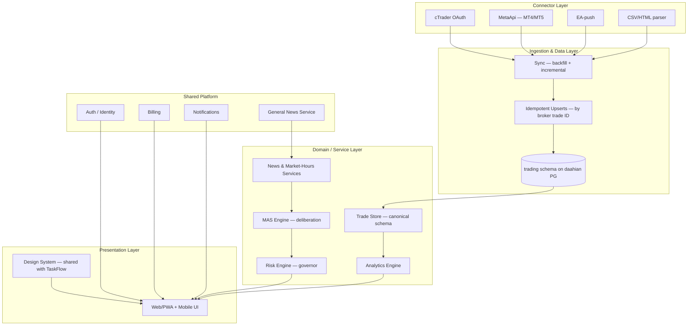
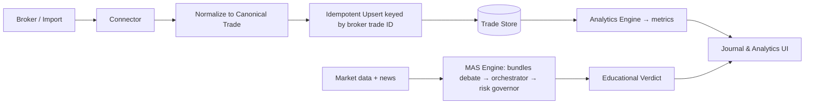

# Architecture — Four Layers + Shared Platform

## The four product layers

1. **Presentation** — platform-agnostic UI (web/PWA + mobile). Reuses the **design system
   shared with TaskFlow** (RTL Persian tokens, `IconView`/`UiIcon` Lucide icon set, Persian
   numerals, themed backgrounds).
2. **Domain / Service** — the canonical **Trade Store** (normalized schema), the
   **analytics engine**, **news / market-hours services**, the **MAS engine**, and the
   **risk engine** (governor).
3. **Ingestion & Data** — sync (backfill + incremental), **idempotent upserts** keyed by
   broker trade ID, and storage (shared daahian PostgreSQL, `trading` schema).
4. **Connector** — the cTrader OAuth adapter, the MetaApi adapter, the EA-push adapter,
   and the report/CSV parser.

## Shared platform (consumed, not owned)

Auth, accounts, billing, notifications, general news, and the design system — all provided
by the [shared platform layer](../00-extraction/shared-platform.md).

## Layer diagram (Mermaid)

## Data flow (Mermaid)

## Canonical Trade Schema and metrics

See [trade-schema.md](trade-schema.md) for the normalized trade record and the metrics
derived from it (win rate, R-multiple, expectancy, drawdown).
