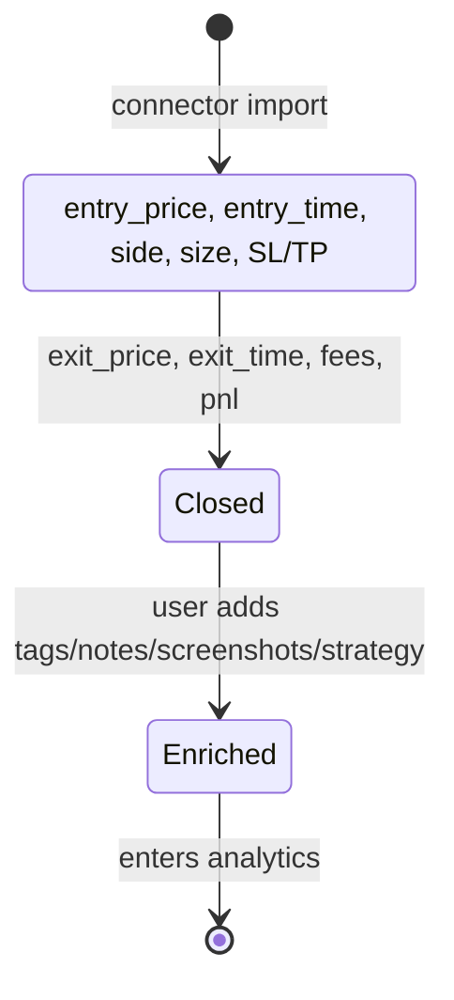

# Canonical Trade Schema & Derived Metrics

## Why a canonical schema

Different brokers report trades differently. cTrader, MT4, MT5, and CSV/HTML statements
all use different field names and units. The app normalizes **every** incoming trade into
one **Canonical Trade** record before storage. This is what makes analytics consistent and
what makes broker connectors swappable.

The canonical trade is stored via **idempotent upsert** keyed by the **broker trade ID**, so
re-importing the same statement never creates duplicates.

## Canonical Trade Schema

| Field | Type | Description |
|-------|------|-------------|
| `trade_id` | UUID | Internal primary key. |
| `broker_trade_id` | TEXT (unique per account) | The broker's own trade ID; the **idempotency key**. |
| `account_id` | FK → `trading.accounts` | Which connected account this trade belongs to. |
| `instrument` | TEXT | e.g., `EURUSD`, `XAUUSD`, `BTCUSDT`. |
| `asset_class` | ENUM | `forex` / `crypto`. |
| `side` | ENUM | `buy` / `sell`. |
| `size` | NUMERIC | Position size (lots / units / contracts). |
| `entry_price` | NUMERIC | Fill price on open. |
| `exit_price` | NUMERIC | Fill price on close. |
| `entry_time` | TIMESTAMPTZ | Open timestamp. |
| `exit_time` | TIMESTAMPTZ | Close timestamp. |
| `stop_loss` | NUMERIC NULL | SL level (if set). |
| `take_profit` | NUMERIC NULL | TP level (if set). |
| `fees` | NUMERIC | Commission + swap + other fees. |
| `pnl` | NUMERIC | Realized PnL in account currency (gross minus fees). |
| `session` | ENUM | Derived: the session at entry (asia/london/new_york/overlap). |
| — user fields — | | |
| `tags` | TEXT[] | User-applied tags. |
| `notes` | TEXT | User notes. |
| `screenshots` | TEXT[] | URLs (stored in object storage). |
| `strategy` | TEXT | User-labeled strategy name. |
| `created_at` / `updated_at` | TIMESTAMPTZ | Audit. |

Every table in the `trading` schema carries the daahian multi-tenant columns (`tenant`,
soft-delete `deleted_at`) and is RLS-scoped to `tenant = 'trading'`.

## Derived metrics

All metrics are computed by the analytics engine from the canonical trades:

- **Win rate** — fraction of closed trades with `pnl > 0`.
- **R-multiple** — profit/loss expressed in units of risk: `(pnl) / (initial risk)`, where
  initial risk = `|entry_price − stop_loss| × size` (the amount that would have been lost
  if stopped out). A +2R trade made twice its risk; a −1R trade hit its stop.
- **Expectancy** — the average R-multiple per trade: `E = Σ(R_i) / N`. Positive expectancy
  means the system is profitable over the sample; negative means it isn't.
- **Drawdown** — the peak-to-trough decline of the equity curve, as a percentage or
  currency amount. Measures worst-case pain.
- **Session / regime breakdowns** — the above metrics sliced by trading session (London,
  New York, overlap...) and by market regime, so the trader can see *where* their edge is.

## Mermaid: trade lifecycle

## Idempotency example

If a user imports the same MT5 HTML statement twice, every trade has a stable
`broker_trade_id`. The upsert matches on `(account_id, broker_trade_id)` and **updates**
the row instead of inserting a duplicate. The trade count and every metric stay correct.
